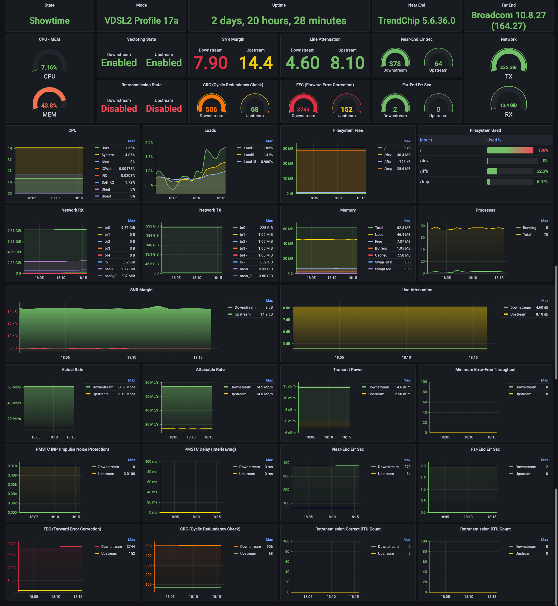

<h1 align="center">xDSL Exporter</h1>

<div align="center">
 <strong>
   A Prometheus Exporter for your xDSL Modem
 </strong>
</div>

<br />

**ARTICLE:** [How to monitor an xDSL Modem using a Prometheus Exporter plugin and Grafana Agent on Grafana Cloud with Grafana OnCall](https://grafana.com/blog/2023/03/17/how-to-monitor-an-xdsl-modem-using-a-prometheus-exporter-plugin-and-grafana-agent-on-grafana-cloud-with-grafana-oncall/?mdm=github)

## Overview



## Prerequisites

* Enable SSH or Telnet on your modem
* Set idle Timeout set to 0 (infinite)

## Installation

```
$ git clone git@github.com:Dentrax/xdsl-exporter.git
$ cd xdsl-exporter
$ go run . --target-client <VENDOR>
```

* Please see the vendor list below for supported vendors.
* Please read the Disclaimer section below before using this exporter.

## Usage

```
Usage:
  xdsl-exporter [flags]

Flags:
  -h, --help                           help for xdsl-exporter
      --known-hosts-path string        Path to your known_hosts file. (default "~/.ssh/known_hosts")
      --listen-address string          Address on which to expose metrics and web interface. (default ":9090")
      --metrics-path string            Path under which to expose metrics. (default "/metrics")
      --target-client string           Broadcom (SSH),Broadcom (Telnet),DrayTek (Telnet),FRITZ!Box,Lantiq (SSH),Lantiq (Telnet),MediaTek (SSH),MediaTek (Telnet),Sagemcom,Speedport
      --target-host string             Hostname or IP address of the target xDSL Modem (default "192.168.1.1")
      --target-password string         Host password
      --target-port int                Port of the target xDSL Modem (default 22)
      --target-ssh-key-path string     Path to the SSH key to use for authentication
      --target-ssh-passphrase string   Passphrase to use for the SSH key
      --target-user string             Host user (default "admin")
```

## Supported Vendors

- Broadcom (SSH): `broadcom_ssh`
- Broadcom (Telnet): `broadcom_telnet`
- DrayTek (Telnet): `draytek_telnet`
- FRITZ!Box: `fritzbox`
- Lantiq (SSH): `lantiq_ssh`
- Lantiq (Telnet): `lantiq_telnet`
- MediaTek (SSH): `mediatek_ssh`
- MediaTek (Telnet): `mediatek_telnet`
- Sagemcom: `sagemcom`
- Speedport: `speedport`

## Known Issues

- If SSH connection get closed by the target, the exporter will not reconnect automatically. You need to restart the exporter.
- If modem is highly loaded (e.g. full bandwidth Steam downloads), the export process might take longer than the default scrape interval of 15 seconds. This will result in a timeout and the modem will not be scraped by Prometheus. You can increase both of the scrape interval and timeout to avoid this issue.

# Special Thanks

| Package                                      | Author                                                 | License                                                                              |
|:---------------------------------------------|:-------------------------------------------------------|:-------------------------------------------------------------------------------------|
| [go-dsl](https://github.com/janh/go-dsl) | [Jan Hoffmann](https://github.com/janh)                | [Mozilla Public License 2.0](https://github.com/janh/go-dsl/blob/master/LICENSE)           |
| [rtop](https://github.com/rapidloop/rtop)    | [RapidLoop](https://github.com/rapidloop)              | [MIT](https://github.com/rapidloop/rtop/blob/master/LICENSE)              |

- Thanks to everyone who contributed these libraries and [others](https://github.com/Dentrax/xdsl-exporter/blob/main/go.mod) that made this project possible.

# Disclaimer

I accept no responsibility for any damage that may occur to your device during your installation, and such damages and exclusion of warranty is not by reason of my negligence. You are under this agreement. You use at your own risk.

# License

*cocert* was created by [Furkan 'Dentrax' Türkal](https://twitter.com/furkanturkaI)

The base project code is licensed under [Apache 2.0](https://opensource.org/licenses/Apache-2.0) unless otherwise specified. Please see the **[LICENSE](https://github.com/Dentrax/xdsl-exporter/blob/main/LICENSE)** file for more information.

<kbd>Best Regards</kbd>
